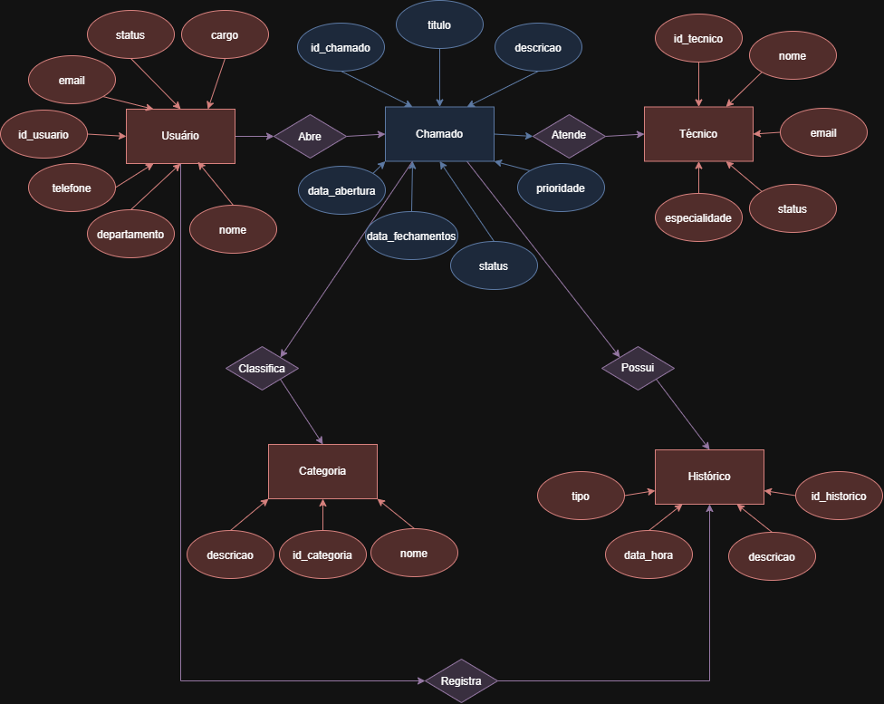
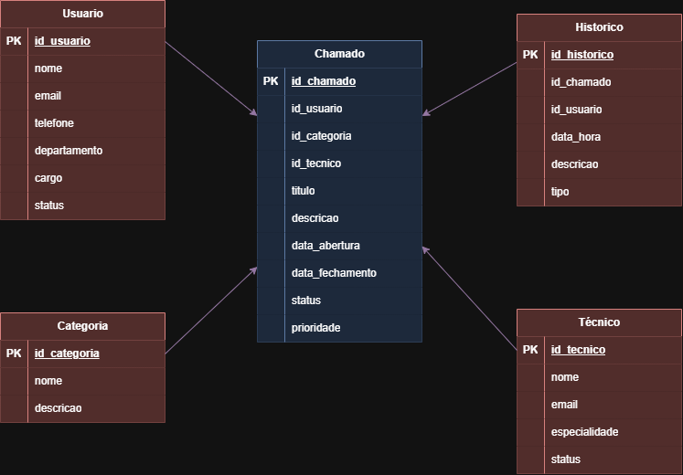

# VPF01 - Banco de Dados

## Desafio

### Atendimento a Chamados

Este projeto foi desenvolvido para a Verificação Prática Formativa (VPF01) da disciplina de Banco de Dados. O objetivo é criar um banco de dados para controlar os atendimentos de suporte técnico, registrando usuários, técnicos, categorias, chamados e o histórico de cada atendimento.

---

## Entidades do Sistema

|Entidade|Atributos básicos|Descrição|
|--------|-----------------|---------|
|Usuário|id, nome, email, telefone, departamento, cargo, status|Pessoa que solicita ou recebe atendimento|
|Chamado|id, titulo, descricao, data_abertura, data_fechamento, status, prioridade, id_usuario, id_categoria, id_tecnico|Registra a solicitação ou incidente|
|Técnico|id, nome, email, especialidade, status|Profissional responsável pelo atendimento do chamado.|
|Categoria|id, nome, descricao|Classifica o chamado, por exemplo: Hardware, Software, Rede ou Acesso.|
|Histórico/Comentários|id, id_chamado, id_usuario, data_hora, descricao, tipo|Armazena comentários, atualizações e ações realizadas durante o atendimento e Solução.|

---

## MER Conceitual



---

## MER Lógico



---

## Dicionário de Dados

| Entidade | Atributo | Tipo | Tamanho | Descrição |
|----------|----------|------|:-------:|-----------|
| Usuário | id_usuario | INT | 11 | Identificador do usuário |
| Usuário | nome | VARCHAR | 100 | Nome do usuário |
| Usuário | email | VARCHAR | 100 | Endereço de e-mail |
| Usuário | telefone | VARCHAR | 20 | Telefone para contato |
| Usuário | departamento | VARCHAR | 50 | Departamento do usuário |
| Usuário | cargo | VARCHAR | 50 | Cargo ocupado |
| Usuário | status | VARCHAR | 20 | Situação do usuário |
| Técnico | id_tecnico | INT | 11 | Identificador do técnico |
| Técnico | nome | VARCHAR | 100 | Nome do técnico |
| Técnico | email | VARCHAR | 100 | E-mail do técnico |
| Técnico | especialidade | VARCHAR | 100 | Área de especialização |
| Técnico | status | VARCHAR | 20 | Situação do técnico |
| Categoria | id_categoria | INT | 11 | Identificador da categoria |
| Categoria | nome | VARCHAR | 50 | Nome da categoria |
| Categoria | descricao | VARCHAR | 255 | Descrição da categoria |
| Chamado | id_chamado | INT | 11 | Identificador do chamado |
| Chamado | titulo | VARCHAR | 150 | Título do chamado |
| Chamado | descricao | TEXT | - | Descrição do problema |
| Chamado | data_abertura | DATETIME | - | Data e hora da abertura |
| Chamado | data_fechamento | DATETIME | - | Data e hora do encerramento |
| Chamado | status | VARCHAR | 30 | Situação atual |
| Chamado | prioridade | VARCHAR | 20 | Prioridade do chamado |
| Chamado | id_usuario | INT | 11 | Usuário solicitante |
| Chamado | id_categoria | INT | 11 | Categoria do chamado |
| Chamado | id_tecnico | INT | 11 | Técnico responsável |
| Histórico | id_historico | INT | 11 | Identificador do histórico |
| Histórico | id_chamado | INT | 11 | Chamado relacionado |
| Histórico | id_usuario | INT | 11 | Usuário que realizou a ação |
| Histórico | data_hora | DATETIME | - | Data e hora da atualização |
| Histórico | descricao | TEXT | - | Descrição da atualização |
| Histórico | tipo | VARCHAR | 30 | Tipo de registro |

---

## Dados de teste em CSV

 - <a href="categoria.csv">categoria.csv</a>
 - <a href="chamado.csv">chamado.csv</a>
 - <a href="historico.csv">historico.csv</a>
 - <a href="tecnico.csv">tecnico.csv</a>
 - <a href="usuario.csv">usuario.csv</a>

---

## Script SQL - DDL

```
CREATE DATABASE atendimento_chamados;

USE atendimento_chamados;

CREATE TABLE usuario (
    id_usuario INT PRIMARY KEY AUTO_INCREMENT,
    nome VARCHAR(100) NOT NULL,
    email VARCHAR(100) NOT NULL,
    telefone VARCHAR(20),
    departamento VARCHAR(50),
    cargo VARCHAR(50),
    status VARCHAR(20) NOT NULL
);

CREATE TABLE tecnico (
    id_tecnico INT PRIMARY KEY AUTO_INCREMENT,
    nome VARCHAR(100) NOT NULL,
    email VARCHAR(100) NOT NULL,
    especialidade VARCHAR(100),
    status VARCHAR(20) NOT NULL
);

CREATE TABLE categoria (
    id_categoria INT PRIMARY KEY AUTO_INCREMENT,
    nome VARCHAR(50) NOT NULL,
    descricao VARCHAR(255)
);

CREATE TABLE chamado (
    id_chamado INT PRIMARY KEY AUTO_INCREMENT,
    titulo VARCHAR(150) NOT NULL,
    descricao TEXT NOT NULL,
    data_abertura DATETIME NOT NULL,
    data_fechamento DATETIME,
    status VARCHAR(30) NOT NULL,
    prioridade VARCHAR(20) NOT NULL,
    id_usuario INT NOT NULL,
    id_categoria INT NOT NULL,
    id_tecnico INT,

    CONSTRAINT fk_chamado_usuario
        FOREIGN KEY (id_usuario)
        REFERENCES usuario(id_usuario),

    CONSTRAINT fk_chamado_categoria
        FOREIGN KEY (id_categoria)
        REFERENCES categoria(id_categoria),

    CONSTRAINT fk_chamado_tecnico
        FOREIGN KEY (id_tecnico)
        REFERENCES tecnico(id_tecnico)
);

CREATE TABLE historico (
    id_historico INT PRIMARY KEY AUTO_INCREMENT,
    id_chamado INT NOT NULL,
    id_usuario INT NOT NULL,
    data_hora DATETIME NOT NULL,
    descricao TEXT NOT NULL,
    tipo VARCHAR(30) NOT NULL,

    CONSTRAINT fk_historico_chamado
        FOREIGN KEY (id_chamado)
        REFERENCES chamado(id_chamado),

    CONSTRAINT fk_historico_usuario
        FOREIGN KEY (id_usuario)
        REFERENCES usuario(id_usuario)
);

```

---

## Script SQL - DML

```
USE atendimento_chamados;

INSERT INTO usuario
(id_usuario, nome, email, telefone, departamento, cargo, status)
VALUES
(1, 'Gabriel Ferreira', 'gabriel.ferreira@email.com', '11984561234', 'Financeiro', 'Assistente', 'Ativo'),
(2, 'Larissa Almeida', 'larissa.almeida@email.com', '11993456781', 'Recursos Humanos', 'Analista', 'Ativo'),
(3, 'Bruno Carvalho', 'bruno.carvalho@email.com', '11992345678', 'Marketing', 'Supervisor', 'Ativo'),
(4, 'Camila Rodrigues', 'camila.rodrigues@email.com', '11991234567', 'Administrativo', 'Coordenadora', 'Ativo'),
(5, 'Matheus Gomes', 'matheus.gomes@email.com', '11990123456', 'Comercial', 'Vendedor', 'Inativo');

INSERT INTO tecnico
(id_tecnico, nome, email, especialidade, status)
VALUES
(1, 'Felipe Martins', 'felipe.martins@empresa.com', 'Hardware', 'Ativo'),
(2, 'Amanda Ribeiro', 'amanda.ribeiro@empresa.com', 'Software', 'Ativo'),
(3, 'Ricardo Nunes', 'ricardo.nunes@empresa.com', 'Redes', 'Ativo'),
(4, 'Patrícia Souza', 'patricia.souza@empresa.com', 'Segurança', 'Ativo'),
(5, 'Diego Moraes', 'diego.moraes@empresa.com', 'Banco de Dados', 'Inativo');

INSERT INTO categoria
(id_categoria, nome, descricao)
VALUES
(1, 'Hardware', 'Falhas em computadores e equipamentos'),
(2, 'Software', 'Problemas em programas e aplicações'),
(3, 'Rede', 'Falhas de conexão e internet'),
(4, 'Acesso', 'Problemas relacionados a login e permissões'),
(5, 'Segurança', 'Incidentes relacionados à segurança da informação');

INSERT INTO chamado
(id_chamado, titulo, descricao, data_abertura, data_fechamento, status, prioridade, id_usuario, id_categoria, id_tecnico)
VALUES
(1, 'Monitor sem imagem', 'O monitor do setor financeiro não exibe imagem.', '2026-09-14 08:10:00', '2026-09-14 10:20:00', 'Fechado', 'Alta', 1, 1, 1),
(2, 'Erro ao abrir sistema', 'O sistema de gestão apresenta erro durante o login.', '2026-09-15 09:40:00', NULL, 'Em andamento', 'Média', 2, 2, 2),
(3, 'Internet oscilando', 'A conexão da empresa apresenta quedas constantes.', '2026-09-16 11:15:00', '2026-09-16 15:00:00', 'Fechado', 'Alta', 3, 3, 3),
(4, 'Acesso bloqueado', 'Funcionário não consegue acessar o portal interno.', '2026-09-17 14:30:00', NULL, 'Aberto', 'Média', 4, 4, 4),
(5, 'Notebook muito lento', 'O notebook demora para iniciar e abrir programas.', '2026-09-18 16:20:00', NULL, 'Em andamento', 'Baixa', 5, 1, 1);

INSERT INTO historico
(id_historico, id_chamado, id_usuario, data_hora, descricao, tipo)
VALUES
(1, 1, 1, '2026-09-14 08:30:00', 'Chamado registrado e enviado para análise técnica.', 'Atualização'),
(2, 1, 1, '2026-09-14 09:40:00', 'Foi identificado defeito no cabo de vídeo.', 'Diagnóstico'),
(3, 1, 1, '2026-09-14 10:20:00', 'Cabo substituído e equipamento funcionando normalmente.', 'Solução'),
(4, 2, 2, '2026-09-15 10:00:00', 'Equipe iniciou a verificação do sistema.', 'Atualização'),
(5, 3, 3, '2026-09-16 15:00:00', 'Configuração da rede ajustada e conexão estabilizada.', 'Solução');

```
---
